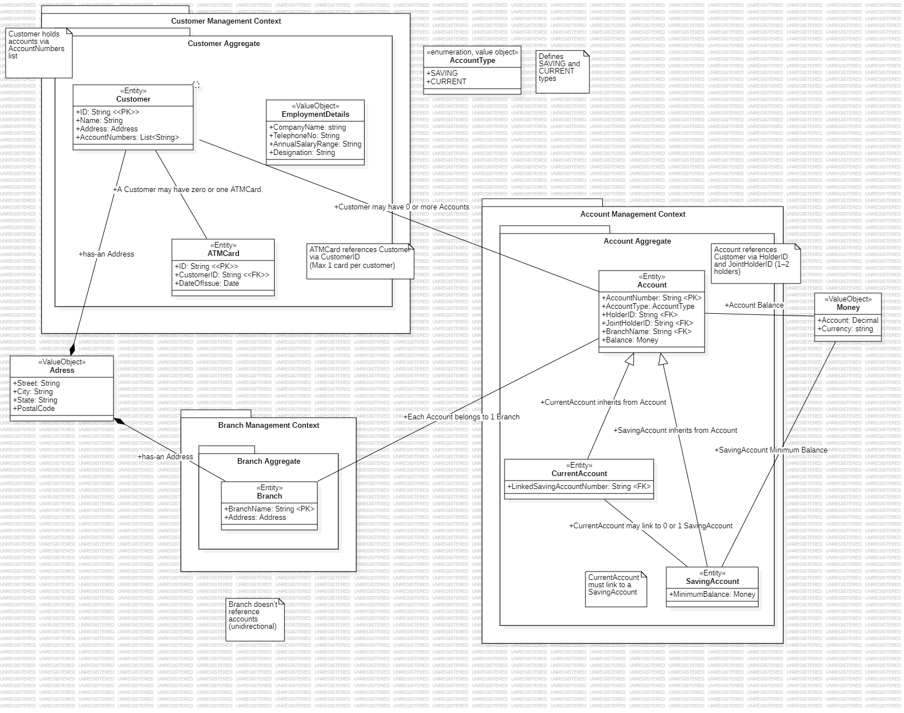
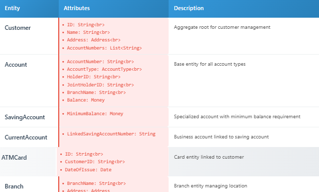
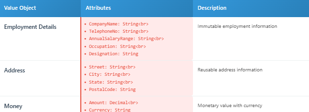

## Banking Domain Model - Domain Driven Design

I created a project that builds a domain model for a banking application using Domain-Driven Design (DDD) principles. This model shows the main business ideas and how they connect in a banking system.

#### In this banking app:

1. Customers can open accounts, which can be either saving accounts or current accounts.

2. Each account can have one or two holders (single or joint account).

3. Customers can have as many accounts as they want.

4. Each customer can apply for an ATM card, but only one card per customer is allowed.

5. Accounts belong to specific bank branches.

6. Customer information is kept separate and does not depend on whether their accounts are active or closed.

---
### Task 1: Domain Objects Identification

#### Bounded Contexts

1. **Customer Management Context** : Handles customer information, employment details, and ATM card services

2. **Account Management Context** : 
Manages account operations, balances, and account types

3. **Branch Management Context** : Handles branch information and location data

#### Aggregates

**Customer Aggregate (Aggregate Root: Customer)**
1. Customer (Entity)
2. Employment Details (Value Object)
3. Address (Value Object)
4. ATM Card (Entity)

**Account Aggregate (Aggregate Root: Account)**

1. Account (Entity)
2. Saving Account (Entity - inherits from Account)
3. Current Account (Entity - inherits from Account)
4. Money (Value Object)
5. Account Type (Enumeration/Value Object)

**Branch Aggregate (Aggregate Root: Branch)** : 
Branch (Entity)
Address (Value Object)

#### Entities : 

#### Value Objects : 

### Task 2: Relationships and Associations

I looked at how different entities (like Customer, Account, and Branch) are related to each other in a banking system. These relationships help define how data is structured and how different parts of the system interact.

#### Within the Customer Management Context

***Customer → Employment Details (Composition 1:1)***
1. A customer owns their employment details.
2. These two are tightly connected – if the customer is deleted, the employment details are deleted too.
3. I use composition here because their lifecycles are bound together.

***Customer → Address (Composition 1:1)***
1. A customer has one address.
2. This address is a value object – it doesn’t change and doesn’t exist on its own.
3. This is also composition because the address is part of the customer.

***Customer → ATM Card (Aggregation 1:0..1)***
1. A customer may or may not have an ATM card.
2. The ATM card has its own life – it can exist even if the customer is removed.
3. I use aggregation here since it’s a weaker relationship.

#### Within the Account Management Context
***Account → Money (Composition 1:1)***

1. An account holds money as its balance.
2. The money value is part of the account and doesn’t exist separately.
3. So, I used composition.

***Account → AccountType (Association 1:1)***

1. Every account has one type, like savings or current.
2. The account type comes from a predefined list (an enumeration).
3. This is a regular association.

***SavingAccount → CurrentAccount (Association 0..1:0..1)***

1. Sometimes, a current account is linked to a savings account, or the other way around.
2. This connection is optional on both sides.
3. So, I show it as a two-way association.

#### Cross-Context Relationships

***Customer → Account (Association 1:0..)***

1. A customer can hold zero or more accounts.
2. This is shown in the system using an AccountNumbers list inside the customer entity.
3. It’s a regular association.

***Account → Branch *(Association :1)***

1. Many accounts can belong to one branch.
2. The branch doesn’t keep track of which accounts it has.
3. This is a unidirectional association.

***Account → Customer (Association 1:1..2)***

1. Each account has one or two holders – it can be a single or joint account.
2. This is shown using HolderID and JointHolderID in the account.
3. Again, this is a normal association.

---

By doing this task, I understood how to break down a banking system into smaller parts using Domain-Driven Design (DDD).

I learned how to:

1. Identify domain objects like entities and value objects.
2. Group them into bounded contexts such as Customer, Account, and Branch management.
3. Build aggregates with clear aggregate roots.
4. Use different types of relationships like composition, aggregation, and association depending on how closely connected the objects are.

I also understood that each part of the system should have a clear purpose and should only handle specific responsibilities. For example, customer details are managed separately from account operations.
This made me realize how DDD helps avoid confusion and keeps the system well-structured, making it easier to build and change as business needs grow.

